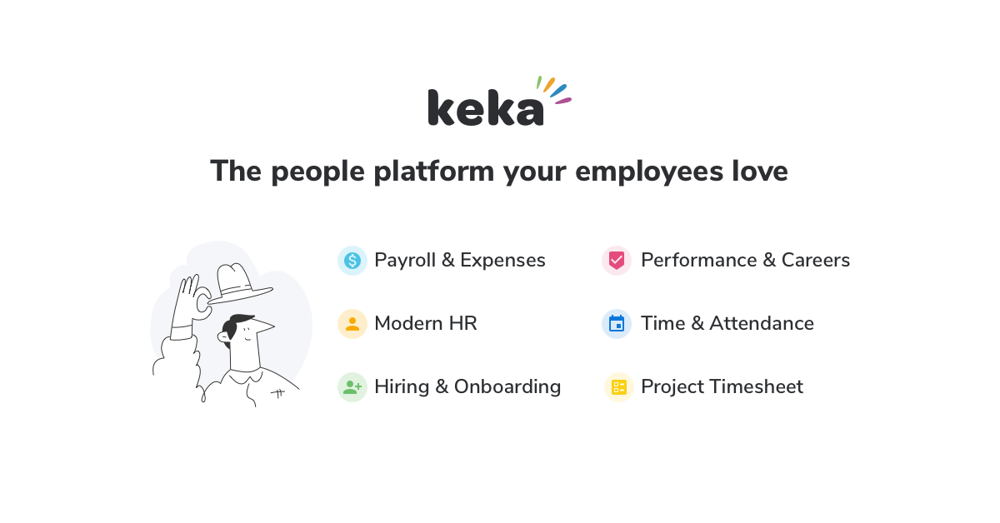

<div align="left">

[](https://keka.com)

# [Keka hr](https://keka.com)<a id="keka-hr"></a>

Here's our story,

It all began with the frustration of using software that sucks. Prior to starting Keka, our core team was a 100 person business that needed an easy to use software for managing employees. We looked everywhere and all we found were software that was lousy and hard to use. We felt SME businesses in India deserved something better. Something awesome actually!

Thus emerged Keka!

</div>

## Table of Contents<a id="table-of-contents"></a>

<!-- toc -->

- [Installation](#installation)
- [Getting Started](#getting-started)
- [Reference](#reference)
  * [`kekahr.asset.getAll`](#kekahrassetgetall)
  * [`kekahr.assetCategory.getAll`](#kekahrassetcategorygetall)
  * [`kekahr.assetCondition.getAll`](#kekahrassetconditiongetall)
  * [`kekahr.assetType.getAll`](#kekahrassettypegetall)
  * [`kekahr.attendance.getRecordsInRange`](#kekahrattendancegetrecordsinrange)
  * [`kekahr.attendanceCaptureScheme.getAll`](#kekahrattendancecaptureschemegetall)
  * [`kekahr.authentication.getAccessToken`](#kekahrauthenticationgetaccesstoken)
  * [`kekahr.badge.getList`](#kekahrbadgegetlist)
  * [`kekahr.clients.createClientIdentifier`](#kekahrclientscreateclientidentifier)
  * [`kekahr.clients.getAll`](#kekahrclientsgetall)
  * [`kekahr.clients.getById`](#kekahrclientsgetbyid)
  * [`kekahr.clients.updateDetails`](#kekahrclientsupdatedetails)
  * [`kekahr.currency.getAll`](#kekahrcurrencygetall)
  * [`kekahr.departments.getAll`](#kekahrdepartmentsgetall)
  * [`kekahr.employees.createEmployee`](#kekahremployeescreateemployee)
  * [`kekahr.employees.getAll`](#kekahremployeesgetall)
  * [`kekahr.employees.getAllUpdateFields`](#kekahremployeesgetallupdatefields)
  * [`kekahr.employees.getById`](#kekahremployeesgetbyid)
  * [`kekahr.employees.updateJobDetails`](#kekahremployeesupdatejobdetails)
  * [`kekahr.employees.updatePersonalDetails`](#kekahremployeesupdatepersonaldetails)
  * [`kekahr.expense.getAllClaims`](#kekahrexpensegetallclaims)
  * [`kekahr.expenseCategory.getAllCategories`](#kekahrexpensecategorygetallcategories)
  * [`kekahr.expensePolicy.listAllExpensePolicies`](#kekahrexpensepolicylistallexpensepolicies)
  * [`kekahr.goal.listWithHierarchy`](#kekahrgoallistwithhierarchy)
  * [`kekahr.goal.updateProgress`](#kekahrgoalupdateprogress)
  * [`kekahr.groups.getAll`](#kekahrgroupsgetall)
  * [`kekahr.groups.getAllGroupTypes`](#kekahrgroupsgetallgrouptypes)
  * [`kekahr.holidayCalendar.getAllHolidaysCalendar`](#kekahrholidaycalendargetallholidayscalendar)
  * [`kekahr.jobTitle.getAll`](#kekahrjobtitlegetall)
  * [`kekahr.jobs.addCandidateNote`](#kekahrjobsaddcandidatenote)
  * [`kekahr.jobs.getAllPublishedJobs`](#kekahrjobsgetallpublishedjobs)
  * [`kekahr.jobs.getApplicationFields`](#kekahrjobsgetapplicationfields)
  * [`kekahr.jobs.getCandidateInterviews`](#kekahrjobsgetcandidateinterviews)
  * [`kekahr.jobs.getCandidateScorecards`](#kekahrjobsgetcandidatescorecards)
  * [`kekahr.jobs.getCandidates`](#kekahrjobsgetcandidates)
  * [`kekahr.jobs.postCandidate`](#kekahrjobspostcandidate)
  * [`kekahr.jobs.updateCandidate`](#kekahrjobsupdatecandidate)
  * [`kekahr.leaveBalance.getAllBalances`](#kekahrleavebalancegetallbalances)
  * [`kekahr.leaveRequests.createRequestIdentifier`](#kekahrleaverequestscreaterequestidentifier)
  * [`kekahr.leaveRequests.getAllBetweenDates`](#kekahrleaverequestsgetallbetweendates)
  * [`kekahr.leaveTypes.listAll`](#kekahrleavetypeslistall)
  * [`kekahr.locations.getAll`](#kekahrlocationsgetall)
  * [`kekahr.noticePeriod.getAll`](#kekahrnoticeperiodgetall)
  * [`kekahr.payBands.getAll`](#kekahrpaybandsgetall)
  * [`kekahr.payCycles.getAll`](#kekahrpaycyclesgetall)
  * [`kekahr.payCycles.getBatchPayments`](#kekahrpaycyclesgetbatchpayments)
  * [`kekahr.payCycles.getPayBatches`](#kekahrpaycyclesgetpaybatches)
  * [`kekahr.payCycles.getPayRegister`](#kekahrpaycyclesgetpayregister)
  * [`kekahr.payCycles.updatePaymentsStatus`](#kekahrpaycyclesupdatepaymentsstatus)
  * [`kekahr.payGrades.getAll`](#kekahrpaygradesgetall)
  * [`kekahr.payGroups.getAll`](#kekahrpaygroupsgetall)
  * [`kekahr.praise.createPraiseIdentifier`](#kekahrpraisecreatepraiseidentifier)
  * [`kekahr.praise.listEmployeesPraises`](#kekahrpraiselistemployeespraises)
  * [`kekahr.projectPhases.createPhaseIdentifier`](#kekahrprojectphasescreatephaseidentifier)
  * [`kekahr.projectPhases.getAll`](#kekahrprojectphasesgetall)
  * [`kekahr.projects.createProjectIdentifier`](#kekahrprojectscreateprojectidentifier)
  * [`kekahr.projects.getAll`](#kekahrprojectsgetall)
  * [`kekahr.projects.getAllocations`](#kekahrprojectsgetallocations)
  * [`kekahr.projects.getById`](#kekahrprojectsgetbyid)
  * [`kekahr.projects.getTimesheetEntriesBetweenDates`](#kekahrprojectsgettimesheetentriesbetweendates)
  * [`kekahr.projects.updateDetails`](#kekahrprojectsupdatedetails)
  * [`kekahr.requisitionRequest.getAll`](#kekahrrequisitionrequestgetall)
  * [`kekahr.salaryComponents.getAllComponents`](#kekahrsalarycomponentsgetallcomponents)
  * [`kekahr.talentPool.addCandidate`](#kekahrtalentpooladdcandidate)
  * [`kekahr.talentPool.getAll`](#kekahrtalentpoolgetall)
  * [`kekahr.talentPool.getApplicationFields`](#kekahrtalentpoolgetapplicationfields)
  * [`kekahr.talentPool.getCandidates`](#kekahrtalentpoolgetcandidates)
  * [`kekahr.tasks.createTaskIdentifier`](#kekahrtaskscreatetaskidentifier)
  * [`kekahr.tasks.getAll`](#kekahrtasksgetall)
  * [`kekahr.tasks.listTimeEntriesBetweenDates`](#kekahrtaskslisttimeentriesbetweendates)
  * [`kekahr.tasks.updateTask`](#kekahrtasksupdatetask)
  * [`kekahr.timeFrames.getAll`](#kekahrtimeframesgetall)
  * [`kekahr.timesheetEntries.getBetweenDates`](#kekahrtimesheetentriesgetbetweendates)

<!-- tocstop -->

## Installation<a id="installation"></a>
<div align="center">
  <a href="https://konfigthis.com/sdk-sign-up?company=Keka%20HR&language=TypeScript">
    
  </a>
</div>

## Getting Started<a id="getting-started"></a>

```typescript
import { KekaHr } from "keka-hr-typescript-sdk";

const kekahr = new KekaHr({
  // Defining the base path is optional and defaults to https://.keka.com/api/v1
  // basePath: "https://.keka.com/api/v1",
  accessToken: "ACCESS_TOKEN",
  oauthClientId: "CLIENT_ID",
  oauthClientSecret: "CLIENT_SECRET",
});

const getAllResponse = await kekahr.asset.getAll({});

console.log(getAllResponse);
```

## Reference<a id="reference"></a>


### `kekahr.asset.getAll`<a id="kekahrassetgetall"></a>

Get all Assets

#### 🛠️ Usage<a id="🛠️-usage"></a>

```typescript
const getAllResponse = await kekahr.asset.getAll({});
```

#### ⚙️ Parameters<a id="⚙️-parameters"></a>

##### assetIds: `string`<a id="assetids-string"></a>

The asset ids.

##### employeeIds: `string`<a id="employeeids-string"></a>

The employee ids.

##### assetStatus: `string`<a id="assetstatus-string"></a>

The asset status.

##### lastModified: `string`<a id="lastmodified-string"></a>

The last modified.

##### pageNumber: `number`<a id="pagenumber-number"></a>

##### pageSize: `number`<a id="pagesize-number"></a>

Represents how many results you\'d like to retrieve per request (page). Default is 100. Max is 200

#### 🔄 Return<a id="🔄-return"></a>

[AssetPagedResponse](./models/asset-paged-response.ts)

#### 🌐 Endpoint<a id="🌐-endpoint"></a>

`/assets` `GET`

[🔙 **Back to Table of Contents**](#table-of-contents)

---


### `kekahr.assetCategory.getAll`<a id="kekahrassetcategorygetall"></a>

Get all Asset Categories

#### 🛠️ Usage<a id="🛠️-usage"></a>

```typescript
const getAllResponse = await kekahr.assetCategory.getAll({});
```

#### ⚙️ Parameters<a id="⚙️-parameters"></a>

##### assetCategoryIds: `string`<a id="assetcategoryids-string"></a>

The asset category ids.

##### lastModified: `string`<a id="lastmodified-string"></a>

The last modified.

##### pageNumber: `number`<a id="pagenumber-number"></a>

##### pageSize: `number`<a id="pagesize-number"></a>

Represents how many results you\'d like to retrieve per request (page). Default is 100. Max is 200

#### 🔄 Return<a id="🔄-return"></a>

[ApiLookupPagedResponse](./models/api-lookup-paged-response.ts)

#### 🌐 Endpoint<a id="🌐-endpoint"></a>

`/assets/categories` `GET`

[🔙 **Back to Table of Contents**](#table-of-contents)

---


### `kekahr.assetCondition.getAll`<a id="kekahrassetconditiongetall"></a>

Get all Asset Conditions

#### 🛠️ Usage<a id="🛠️-usage"></a>

```typescript
const getAllResponse = await kekahr.assetCondition.getAll({});
```

#### ⚙️ Parameters<a id="⚙️-parameters"></a>

##### assetConditionIds: `string`<a id="assetconditionids-string"></a>

The asset condition ids.

##### lastModified: `string`<a id="lastmodified-string"></a>

The last modified.

##### pageNumber: `number`<a id="pagenumber-number"></a>

##### pageSize: `number`<a id="pagesize-number"></a>

Represents how many results you\'d like to retrieve per request (page). Default is 100. Max is 200

#### 🔄 Return<a id="🔄-return"></a>

[ApiLookupPagedResponse](./models/api-lookup-paged-response.ts)

#### 🌐 Endpoint<a id="🌐-endpoint"></a>

`/assets/conditions` `GET`

[🔙 **Back to Table of Contents**](#table-of-contents)

---


### `kekahr.assetType.getAll`<a id="kekahrassettypegetall"></a>

Get all Asset Types

#### 🛠️ Usage<a id="🛠️-usage"></a>

```typescript
const getAllResponse = await kekahr.assetType.getAll({});
```

#### ⚙️ Parameters<a id="⚙️-parameters"></a>

##### assetTypeIds: `string`<a id="assettypeids-string"></a>

The asset type ids.

##### lastModified: `string`<a id="lastmodified-string"></a>

The last modified.

##### pageNumber: `number`<a id="pagenumber-number"></a>

##### pageSize: `number`<a id="pagesize-number"></a>

Represents how many results you\'d like to retrieve per request (page). Default is 100. Max is 200

#### 🔄 Return<a id="🔄-return"></a>

[ApiLookupPagedResponse](./models/api-lookup-paged-response.ts)

#### 🌐 Endpoint<a id="🌐-endpoint"></a>

`/assets/types` `GET`

[🔙 **Back to Table of Contents**](#table-of-contents)

---


### `kekahr.attendance.getRecordsInRange`<a id="kekahrattendancegetrecordsinrange"></a>

Gets all Attendance records between date range `from` and `to`.If both `from` and `to` are not specified, last 30 days records are returned.From `date` should be before `to` date.The difference between `from` and `to` date cannot be more than **90** days.

#### 🛠️ Usage<a id="🛠️-usage"></a>

```typescript
const getRecordsInRangeResponse = await kekahr.attendance.getRecordsInRange({});
```

#### ⚙️ Parameters<a id="⚙️-parameters"></a>

##### employeeIds: `string`<a id="employeeids-string"></a>

Comma separated list of one or more Employee ids you\'d like to filter on.

##### from: `string`<a id="from-string"></a>

Date from records to retrieve. If not specified defaults to `to - 30` days.

##### to: `string`<a id="to-string"></a>

Date to records can be retrieved. If not specified defaults to `today`.

##### pageNumber: `number`<a id="pagenumber-number"></a>

##### pageSize: `number`<a id="pagesize-number"></a>

Represents how many results you\'d like to retrieve per request (page). Default is 100. Max is 200

#### 🔄 Return<a id="🔄-return"></a>

[AttendanceSummaryPagedResponse](./models/attendance-summary-paged-response.ts)

#### 🌐 Endpoint<a id="🌐-endpoint"></a>

`/time/attendance` `GET`

[🔙 **Back to Table of Contents**](#table-of-contents)

---


### `kekahr.attendanceCaptureScheme.getAll`<a id="kekahrattendancecaptureschemegetall"></a>

Get all captureschemes

#### 🛠️ Usage<a id="🛠️-usage"></a>

```typescript
const getAllResponse = await kekahr.attendanceCaptureScheme.getAll({});
```

#### ⚙️ Parameters<a id="⚙️-parameters"></a>

##### captureschemeIds: `string`<a id="captureschemeids-string"></a>

The capturescheme ids.

##### pageNumber: `number`<a id="pagenumber-number"></a>

##### pageSize: `number`<a id="pagesize-number"></a>

Represents how many results you\'d like to retrieve per request (page). Default is 100. Max is 200

#### 🔄 Return<a id="🔄-return"></a>

[ApiLookupPagedResponse](./models/api-lookup-paged-response.ts)

#### 🌐 Endpoint<a id="🌐-endpoint"></a>

`/time/capturescheme` `GET`

[🔙 **Back to Table of Contents**](#table-of-contents)

---


### `kekahr.authentication.getAccessToken`<a id="kekahrauthenticationgetaccesstoken"></a>

Use this API to fetch access token by passing authentication parameters ( grant_type, scope, client_id, client_secret, api_key) as form-url encoded in the body.

#### 🛠️ Usage<a id="🛠️-usage"></a>

```typescript
const getAccessTokenResponse = await kekahr.authentication.getAccessToken({
  grant_type: "kekaapi",
  scope: "kekaapi",
  client_id: "client_id_example",
  client_secret: "client_secret_example",
  api_key: "api_key_example",
});
```

#### ⚙️ Parameters<a id="⚙️-parameters"></a>

##### grantType: `string`<a id="granttype-string"></a>

##### scope: `string`<a id="scope-string"></a>

##### clientId: `string`<a id="clientid-string"></a>

##### clientSecret: `string`<a id="clientsecret-string"></a>

##### apiKey: `string`<a id="apikey-string"></a>

#### 🔄 Return<a id="🔄-return"></a>

[AuthenticationGetAccessTokenResponse](./models/authentication-get-access-token-response.ts)

#### 🌐 Endpoint<a id="🌐-endpoint"></a>

`/connect/token` `POST`

[🔙 **Back to Table of Contents**](#table-of-contents)

---


### `kekahr.badge.getList`<a id="kekahrbadgegetlist"></a>

Gets all badge.

#### 🛠️ Usage<a id="🛠️-usage"></a>

```typescript
const getListResponse = await kekahr.badge.getList({});
```

#### ⚙️ Parameters<a id="⚙️-parameters"></a>

##### badgeIds: `string`<a id="badgeids-string"></a>

Comma separated list of one or more Badge ids you\'d like to filter on.

##### pageNumber: `number`<a id="pagenumber-number"></a>

##### pageSize: `number`<a id="pagesize-number"></a>

Represents how many results you\'d like to retrieve per request (page). Default is 100. Max is 200

#### 🔄 Return<a id="🔄-return"></a>

[APIBadgePagedResponse](./models/apibadge-paged-response.ts)

#### 🌐 Endpoint<a id="🌐-endpoint"></a>

`/pms/badges` `GET`

[🔙 **Back to Table of Contents**](#table-of-contents)

---


### `kekahr.clients.createClientIdentifier`<a id="kekahrclientscreateclientidentifier"></a>

Create a Client and returns created client identifier.

#### 🛠️ Usage<a id="🛠️-usage"></a>

```typescript
const createClientIdentifierResponse =
  await kekahr.clients.createClientIdentifier({
    name: "name_example",
    code: "code_example",
  });
```

#### ⚙️ Parameters<a id="⚙️-parameters"></a>

##### name: `string`<a id="name-string"></a>

##### code: `string`<a id="code-string"></a>

##### description: `string`<a id="description-string"></a>

##### billingInfo: [`BillingInfo`](./models/billing-info.ts)<a id="billinginfo-billinginfomodelsbilling-infots"></a>

##### phone: `string`<a id="phone-string"></a>

##### website: `string`<a id="website-string"></a>

##### email: `string`<a id="email-string"></a>

#### 🔄 Return<a id="🔄-return"></a>

[StringResponse](./models/string-response.ts)

#### 🌐 Endpoint<a id="🌐-endpoint"></a>

`/psa/clients` `POST`

[🔙 **Back to Table of Contents**](#table-of-contents)

---


### `kekahr.clients.getAll`<a id="kekahrclientsgetall"></a>

Get all clients

#### 🛠️ Usage<a id="🛠️-usage"></a>

```typescript
const getAllResponse = await kekahr.clients.getAll({});
```

#### ⚙️ Parameters<a id="⚙️-parameters"></a>

##### clientIds: `string`<a id="clientids-string"></a>

Comma separated list of one or more employee ids you\'d like to filter on.

##### lastModified: `string`<a id="lastmodified-string"></a>

Date/time when this time off request was last modified, in ISO 8601 format (YYYY-MM-DDThh:mm:ss±hh:mm).

##### pageNumber: `number`<a id="pagenumber-number"></a>

##### pageSize: `number`<a id="pagesize-number"></a>

Represents how many results you\'d like to retrieve per request (page). Default is 100. Max is 200

#### 🔄 Return<a id="🔄-return"></a>

[APIClientPagedResponse](./models/apiclient-paged-response.ts)

#### 🌐 Endpoint<a id="🌐-endpoint"></a>

`/psa/clients` `GET`

[🔙 **Back to Table of Contents**](#table-of-contents)

---


### `kekahr.clients.getById`<a id="kekahrclientsgetbyid"></a>

Gets the specified client based on identifier.

#### 🛠️ Usage<a id="🛠️-usage"></a>

```typescript
const getByIdResponse = await kekahr.clients.getById({
  id: "id_example",
});
```

#### ⚙️ Parameters<a id="⚙️-parameters"></a>

##### id: `string`<a id="id-string"></a>

The identifier.

#### 🔄 Return<a id="🔄-return"></a>

[APIClientResponse](./models/apiclient-response.ts)

#### 🌐 Endpoint<a id="🌐-endpoint"></a>

`/psa/clients/{id}` `GET`

[🔙 **Back to Table of Contents**](#table-of-contents)

---


### `kekahr.clients.updateDetails`<a id="kekahrclientsupdatedetails"></a>

Update Client Details.

#### 🛠️ Usage<a id="🛠️-usage"></a>

```typescript
const updateDetailsResponse = await kekahr.clients.updateDetails({
  id: "id_example",
});
```

#### ⚙️ Parameters<a id="⚙️-parameters"></a>

##### id: `string`<a id="id-string"></a>

The identifier.

##### description: `string`<a id="description-string"></a>

##### name: `string`<a id="name-string"></a>

##### code: `string`<a id="code-string"></a>

##### billingAddress: [`Address`](./models/address.ts)<a id="billingaddress-addressmodelsaddressts"></a>

#### 🔄 Return<a id="🔄-return"></a>

[BooleanResponse](./models/boolean-response.ts)

#### 🌐 Endpoint<a id="🌐-endpoint"></a>

`/psa/clients/{id}` `PUT`

[🔙 **Back to Table of Contents**](#table-of-contents)

---


### `kekahr.currency.getAll`<a id="kekahrcurrencygetall"></a>

Get all currencies

#### 🛠️ Usage<a id="🛠️-usage"></a>

```typescript
const getAllResponse = await kekahr.currency.getAll({});
```

#### ⚙️ Parameters<a id="⚙️-parameters"></a>

##### pageNumber: `number`<a id="pagenumber-number"></a>

##### pageSize: `number`<a id="pagesize-number"></a>

Represents how many results you\'d like to retrieve per request (page). Default is 100. Max is 200

#### 🔄 Return<a id="🔄-return"></a>

[CurrencyPagedResponse](./models/currency-paged-response.ts)

#### 🌐 Endpoint<a id="🌐-endpoint"></a>

`/hris/currencies` `GET`

[🔙 **Back to Table of Contents**](#table-of-contents)

---


### `kekahr.departments.getAll`<a id="kekahrdepartmentsgetall"></a>

Get all departments

#### 🛠️ Usage<a id="🛠️-usage"></a>

```typescript
const getAllResponse = await kekahr.departments.getAll({});
```

#### ⚙️ Parameters<a id="⚙️-parameters"></a>

##### departmentIds: `string`<a id="departmentids-string"></a>

##### lastModified: `string`<a id="lastmodified-string"></a>

The Last Modified Date.

##### pageNumber: `number`<a id="pagenumber-number"></a>

##### pageSize: `number`<a id="pagesize-number"></a>

Represents how many results you\'d like to retrieve per request (page). Default is 100. Max is 200

#### 🔄 Return<a id="🔄-return"></a>

[APIDepartmentViewPagedResponse](./models/apidepartment-view-paged-response.ts)

#### 🌐 Endpoint<a id="🌐-endpoint"></a>

`/hris/departments` `GET`

[🔙 **Back to Table of Contents**](#table-of-contents)

---


### `kekahr.employees.createEmployee`<a id="kekahremployeescreateemployee"></a>

Create an Employee and returns created employee identifier.

#### 🛠️ Usage<a id="🛠️-usage"></a>

```typescript
const createEmployeeResponse = await kekahr.employees.createEmployee({
  displayName: "displayName_example",
  firstName: "firstName_example",
  lastName: "lastName_example",
  email: "email_example",
  gender: 0,
  dateOfBirth: "1970-01-01T00:00:00.00Z",
  dateJoined: "1970-01-01T00:00:00.00Z",
  department: "department_example",
  businessUnit: "businessUnit_example",
  jobTitle: "jobTitle_example",
  location: "location_example",
});
```

#### ⚙️ Parameters<a id="⚙️-parameters"></a>

##### displayName: `string`<a id="displayname-string"></a>

##### firstName: `string`<a id="firstname-string"></a>

##### lastName: `string`<a id="lastname-string"></a>

##### email: `string`<a id="email-string"></a>

##### gender:<a id="gender"></a>

##### dateOfBirth: `string`<a id="dateofbirth-string"></a>

##### dateJoined: `string`<a id="datejoined-string"></a>

##### department: `string`<a id="department-string"></a>

##### businessUnit: `string`<a id="businessunit-string"></a>

##### jobTitle: `string`<a id="jobtitle-string"></a>

##### location: `string`<a id="location-string"></a>

##### employeeNumber: `string`<a id="employeenumber-string"></a>

##### middleName: `string`<a id="middlename-string"></a>

##### mobileNumber: `string`<a id="mobilenumber-string"></a>

##### secondaryJobTitle: `string`<a id="secondaryjobtitle-string"></a>

#### 🔄 Return<a id="🔄-return"></a>

[StringResponse](./models/string-response.ts)

#### 🌐 Endpoint<a id="🌐-endpoint"></a>

`/hris/employees` `POST`

[🔙 **Back to Table of Contents**](#table-of-contents)

---


### `kekahr.employees.getAll`<a id="kekahremployeesgetall"></a>

Gets all employees / the specified employees based on employee search parameters.

#### 🛠️ Usage<a id="🛠️-usage"></a>

```typescript
const getAllResponse = await kekahr.employees.getAll({
  inProbation: false,
  inNoticePeriod: false,
});
```

#### ⚙️ Parameters<a id="⚙️-parameters"></a>

##### employeeIds: `string`<a id="employeeids-string"></a>

Comma separated list of one or more Employee ids you\'d like to filter on.

##### employeeNumbers: `string`<a id="employeenumbers-string"></a>

Comma separated list of one or more Employee numbers you\'d like to filter on.

##### employmentStatus: `string`<a id="employmentstatus-string"></a>

Comma separated list of one or more Employment Status you\'d like to filter on, allowed values are Working, Relieved.

##### inProbation: `boolean`<a id="inprobation-boolean"></a>

Fetches employees who are in probation. The allowed value is true or false.

##### inNoticePeriod: `boolean`<a id="innoticeperiod-boolean"></a>

Fetches employees who are in notice period. The allowed value is true or false.

##### lastModified: `string`<a id="lastmodified-string"></a>

Date/time when this time off request was last modified, in ISO 8601 format (YYYY-MM-DDThh:mm:ss±hh:mm).

##### pageNumber: `number`<a id="pagenumber-number"></a>

##### pageSize: `number`<a id="pagesize-number"></a>

Represents how many results you\'d like to retrieve per request (page). Default is 100. Max is 200

#### 🔄 Return<a id="🔄-return"></a>

[EmployeeProfilePagedResponse](./models/employee-profile-paged-response.ts)

#### 🌐 Endpoint<a id="🌐-endpoint"></a>

`/hris/employees` `GET`

[🔙 **Back to Table of Contents**](#table-of-contents)

---


### `kekahr.employees.getAllUpdateFields`<a id="kekahremployeesgetallupdatefields"></a>

Get all update fields

#### 🛠️ Usage<a id="🛠️-usage"></a>

```typescript
const getAllUpdateFieldsResponse = await kekahr.employees.getAllUpdateFields(
  {}
);
```

#### ⚙️ Parameters<a id="⚙️-parameters"></a>

##### pageNumber: `number`<a id="pagenumber-number"></a>

##### pageSize: `number`<a id="pagesize-number"></a>

Represents how many results you\'d like to retrieve per request (page). Default is 100. Max is 200

#### 🔄 Return<a id="🔄-return"></a>

[EmployeeFieldResponse](./models/employee-field-response.ts)

#### 🌐 Endpoint<a id="🌐-endpoint"></a>

`/hris/employees/updatefields` `GET`

[🔙 **Back to Table of Contents**](#table-of-contents)

---


### `kekahr.employees.getById`<a id="kekahremployeesgetbyid"></a>

Get an employee with specified identifier.

#### 🛠️ Usage<a id="🛠️-usage"></a>

```typescript
const getByIdResponse = await kekahr.employees.getById({
  id: "id_example",
});
```

#### ⚙️ Parameters<a id="⚙️-parameters"></a>

##### id: `string`<a id="id-string"></a>

The identifier.

#### 🔄 Return<a id="🔄-return"></a>

[EmployeeProfileResponse](./models/employee-profile-response.ts)

#### 🌐 Endpoint<a id="🌐-endpoint"></a>

`/hris/employees/{id}` `GET`

[🔙 **Back to Table of Contents**](#table-of-contents)

---


### `kekahr.employees.updateJobDetails`<a id="kekahremployeesupdatejobdetails"></a>

Update employee job details.

#### 🛠️ Usage<a id="🛠️-usage"></a>

```typescript
const updateJobDetailsResponse = await kekahr.employees.updateJobDetails({
  id: "id_example",
  timeType: 0,
});
```

#### ⚙️ Parameters<a id="⚙️-parameters"></a>

##### id: `string`<a id="id-string"></a>

The identifier.

##### employeeNumber: `string`<a id="employeenumber-string"></a>

##### location: `string`<a id="location-string"></a>

##### businessUnit: `string`<a id="businessunit-string"></a>

##### department: `string`<a id="department-string"></a>

##### jobTitle: `string`<a id="jobtitle-string"></a>

##### reportingManager: `string`<a id="reportingmanager-string"></a>

##### attendanceNumber: `string`<a id="attendancenumber-string"></a>

##### timeType:<a id="timetype"></a>

##### attendanceCaptureScheme: `string`<a id="attendancecapturescheme-string"></a>

##### expensePolicy: `string`<a id="expensepolicy-string"></a>

##### noticePeriod: `string`<a id="noticeperiod-string"></a>

##### holidayList: `string`<a id="holidaylist-string"></a>

##### costCenter: `string`<a id="costcenter-string"></a>

##### payBand: `string`<a id="payband-string"></a>

##### payGrade: `string`<a id="paygrade-string"></a>

##### customFields: `{ [key: string]: any; }`<a id="customfields--key-string-any-"></a>

#### 🔄 Return<a id="🔄-return"></a>

[BooleanResponse](./models/boolean-response.ts)

#### 🌐 Endpoint<a id="🌐-endpoint"></a>

`/hris/employees/{id}/jobdetails` `PUT`

[🔙 **Back to Table of Contents**](#table-of-contents)

---


### `kekahr.employees.updatePersonalDetails`<a id="kekahremployeesupdatepersonaldetails"></a>

Update Employee personal details.

#### 🛠️ Usage<a id="🛠️-usage"></a>

```typescript
const updatePersonalDetailsResponse =
  await kekahr.employees.updatePersonalDetails({
    id: "id_example",
    gender: 0,
    maritalStatus: 0,
    bloodGroup: 0,
  });
```

#### ⚙️ Parameters<a id="⚙️-parameters"></a>

##### id: `string`<a id="id-string"></a>

The identifier.

##### displayName: `string`<a id="displayname-string"></a>

##### firstName: `string`<a id="firstname-string"></a>

##### middleName: `string`<a id="middlename-string"></a>

##### lastName: `string`<a id="lastname-string"></a>

##### gender:<a id="gender"></a>

##### dateOfBirth: `string`<a id="dateofbirth-string"></a>

##### workPhone: `string`<a id="workphone-string"></a>

##### homePhone: `string`<a id="homephone-string"></a>

##### personalEmail: `string`<a id="personalemail-string"></a>

##### skypeId: `string`<a id="skypeid-string"></a>

##### maritalStatus:<a id="maritalstatus"></a>

##### marriageDate: `string`<a id="marriagedate-string"></a>

##### relations: [`Relation`](./models/relation.ts)[]<a id="relations-relationmodelsrelationts"></a>

##### bloodGroup:<a id="bloodgroup"></a>

##### currentAddress: [`Address`](./models/address.ts)<a id="currentaddress-addressmodelsaddressts"></a>

##### permanentAddress: [`Address`](./models/address.ts)<a id="permanentaddress-addressmodelsaddressts"></a>

##### professionalSummary: `string`<a id="professionalsummary-string"></a>

##### customFields: `{ [key: string]: any; }`<a id="customfields--key-string-any-"></a>

#### 🔄 Return<a id="🔄-return"></a>

[BooleanResponse](./models/boolean-response.ts)

#### 🌐 Endpoint<a id="🌐-endpoint"></a>

`/hris/employees/{id}/personaldetails` `PUT`

[🔙 **Back to Table of Contents**](#table-of-contents)

---


### `kekahr.expense.getAllClaims`<a id="kekahrexpensegetallclaims"></a>

Get all Expense Claims

#### 🛠️ Usage<a id="🛠️-usage"></a>

```typescript
const getAllClaimsResponse = await kekahr.expense.getAllClaims({});
```

#### ⚙️ Parameters<a id="⚙️-parameters"></a>

##### pageNumber: `number`<a id="pagenumber-number"></a>

##### pageSize: `number`<a id="pagesize-number"></a>

Represents how many results you\'d like to retrieve per request (page). Default is 100. Max is 200

#### 🔄 Return<a id="🔄-return"></a>

[ExpenseClaimPagedResponse](./models/expense-claim-paged-response.ts)

#### 🌐 Endpoint<a id="🌐-endpoint"></a>

`/expense/claims` `GET`

[🔙 **Back to Table of Contents**](#table-of-contents)

---


### `kekahr.expenseCategory.getAllCategories`<a id="kekahrexpensecategorygetallcategories"></a>

Get all Expense Categories

#### 🛠️ Usage<a id="🛠️-usage"></a>

```typescript
const getAllCategoriesResponse = await kekahr.expenseCategory.getAllCategories(
  {}
);
```

#### ⚙️ Parameters<a id="⚙️-parameters"></a>

##### expenseCategoryIds: `string`<a id="expensecategoryids-string"></a>

Comma separated list of one or more  expense categories identifiers you\'d like to filter on.

##### pageNumber: `number`<a id="pagenumber-number"></a>

##### pageSize: `number`<a id="pagesize-number"></a>

Represents how many results you\'d like to retrieve per request (page). Default is 100. Max is 200

#### 🔄 Return<a id="🔄-return"></a>

[ExpenseCategoryPagedResponse](./models/expense-category-paged-response.ts)

#### 🌐 Endpoint<a id="🌐-endpoint"></a>

`/expense/categories` `GET`

[🔙 **Back to Table of Contents**](#table-of-contents)

---


### `kekahr.expensePolicy.listAllExpensePolicies`<a id="kekahrexpensepolicylistallexpensepolicies"></a>

Get all expensepolicies

#### 🛠️ Usage<a id="🛠️-usage"></a>

```typescript
const listAllExpensePoliciesResponse =
  await kekahr.expensePolicy.listAllExpensePolicies({});
```

#### ⚙️ Parameters<a id="⚙️-parameters"></a>

##### expensepolicyIds: `string`<a id="expensepolicyids-string"></a>

The expensepolicy ids.

##### pageNumber: `number`<a id="pagenumber-number"></a>

##### pageSize: `number`<a id="pagesize-number"></a>

Represents how many results you\'d like to retrieve per request (page). Default is 100. Max is 200

#### 🔄 Return<a id="🔄-return"></a>

[ApiLookupPagedResponse](./models/api-lookup-paged-response.ts)

#### 🌐 Endpoint<a id="🌐-endpoint"></a>

`/expensepolicies` `GET`

[🔙 **Back to Table of Contents**](#table-of-contents)

---


### `kekahr.goal.listWithHierarchy`<a id="kekahrgoallistwithhierarchy"></a>

Gets all goals along with parent goal and child goals

#### 🛠️ Usage<a id="🛠️-usage"></a>

```typescript
const listWithHierarchyResponse = await kekahr.goal.listWithHierarchy({});
```

#### ⚙️ Parameters<a id="⚙️-parameters"></a>

##### goalIds: `string`<a id="goalids-string"></a>

Comma separated list of one or more Goal ids you\'d like to filter on.

##### timeFrameIds: `string`<a id="timeframeids-string"></a>

Comma separated list of one or more Time Frame ids you\'d like to filter on.

##### employeeIds: `string`<a id="employeeids-string"></a>

Comma separated list of one or more Employee ids you\'d like to filter on.

##### from: `string`<a id="from-string"></a>

Date/time when goal time period will start, in ISO 8601 format (YYYY-MM-DDThh:mm:ss±hh). If not specified  defaults `to` - 60 days.

##### to: `string`<a id="to-string"></a>

Date/time when goal time period will end, in ISO 8601 format (YYYY-MM-DDThh:mm:ss±hh). If not specified  defaults `from` + 60 days.

##### pageNumber: `number`<a id="pagenumber-number"></a>

##### pageSize: `number`<a id="pagesize-number"></a>

Represents how many results you\'d like to retrieve per request (page). Default is 100. Max is 200

#### 🔄 Return<a id="🔄-return"></a>

[APIGoalPagedResponse](./models/apigoal-paged-response.ts)

#### 🌐 Endpoint<a id="🌐-endpoint"></a>

`/pms/goals` `GET`

[🔙 **Back to Table of Contents**](#table-of-contents)

---


### `kekahr.goal.updateProgress`<a id="kekahrgoalupdateprogress"></a>

Update the goal progress

#### 🛠️ Usage<a id="🛠️-usage"></a>

```typescript
const updateProgressResponse = await kekahr.goal.updateProgress({
  goalId: "goalId_example",
  currentValue: 3.14,
  status: 0,
  updatedBy: "updatedBy_example",
});
```

#### ⚙️ Parameters<a id="⚙️-parameters"></a>

##### currentValue: `number`<a id="currentvalue-number"></a>

##### status:<a id="status"></a>

##### updatedBy: `string`<a id="updatedby-string"></a>

##### goalId: `string`<a id="goalid-string"></a>

The goal identifier.

##### note: `string`<a id="note-string"></a>

#### 🔄 Return<a id="🔄-return"></a>

[BooleanResponse](./models/boolean-response.ts)

#### 🌐 Endpoint<a id="🌐-endpoint"></a>

`/pms/goals/{goalId}/progress` `PUT`

[🔙 **Back to Table of Contents**](#table-of-contents)

---


### `kekahr.groups.getAll`<a id="kekahrgroupsgetall"></a>

Get all Groups

#### 🛠️ Usage<a id="🛠️-usage"></a>

```typescript
const getAllResponse = await kekahr.groups.getAll({});
```

#### ⚙️ Parameters<a id="⚙️-parameters"></a>

##### groupTypeIds: `string`<a id="grouptypeids-string"></a>

Comma separated list of one or more Group Type Ids you’d like to filter on.

##### systemGroupTypes: `string`<a id="systemgrouptypes-string"></a>

Comma separated list of one or more System Group Type you’d like to filter on.

##### lastModified: `string`<a id="lastmodified-string"></a>

The Last Modified.

##### pageNumber: `number`<a id="pagenumber-number"></a>

##### pageSize: `number`<a id="pagesize-number"></a>

Represents how many results you\'d like to retrieve per request (page). Default is 100. Max is 200

#### 🔄 Return<a id="🔄-return"></a>

[GroupPagedResponse](./models/group-paged-response.ts)

#### 🌐 Endpoint<a id="🌐-endpoint"></a>

`/hris/groups` `GET`

[🔙 **Back to Table of Contents**](#table-of-contents)

---


### `kekahr.groups.getAllGroupTypes`<a id="kekahrgroupsgetallgrouptypes"></a>

Gets all Group Types.

#### 🛠️ Usage<a id="🛠️-usage"></a>

```typescript
const getAllGroupTypesResponse = await kekahr.groups.getAllGroupTypes({});
```

#### ⚙️ Parameters<a id="⚙️-parameters"></a>

##### pageNumber: `number`<a id="pagenumber-number"></a>

##### pageSize: `number`<a id="pagesize-number"></a>

Represents how many results you\'d like to retrieve per request (page). Default is 100. Max is 200

#### 🔄 Return<a id="🔄-return"></a>

[GroupTypePagedResponse](./models/group-type-paged-response.ts)

#### 🌐 Endpoint<a id="🌐-endpoint"></a>

`/hris/grouptypes` `GET`

[🔙 **Back to Table of Contents**](#table-of-contents)

---


### `kekahr.holidayCalendar.getAllHolidaysCalendar`<a id="kekahrholidaycalendargetallholidayscalendar"></a>

Get all holidays Calendar

#### 🛠️ Usage<a id="🛠️-usage"></a>

```typescript
const getAllHolidaysCalendarResponse =
  await kekahr.holidayCalendar.getAllHolidaysCalendar({});
```

#### ⚙️ Parameters<a id="⚙️-parameters"></a>

##### holidaysCalendarIds: `string`<a id="holidayscalendarids-string"></a>

The holidaysCalendar ids.

##### pageNumber: `number`<a id="pagenumber-number"></a>

##### pageSize: `number`<a id="pagesize-number"></a>

Represents how many results you\'d like to retrieve per request (page). Default is 100. Max is 200

#### 🔄 Return<a id="🔄-return"></a>

[ApiLookupPagedResponse](./models/api-lookup-paged-response.ts)

#### 🌐 Endpoint<a id="🌐-endpoint"></a>

`/time/holidayscalendar` `GET`

[🔙 **Back to Table of Contents**](#table-of-contents)

---


### `kekahr.jobTitle.getAll`<a id="kekahrjobtitlegetall"></a>

Get all jobtitles

#### 🛠️ Usage<a id="🛠️-usage"></a>

```typescript
const getAllResponse = await kekahr.jobTitle.getAll({});
```

#### ⚙️ Parameters<a id="⚙️-parameters"></a>

##### lastModified: `string`<a id="lastmodified-string"></a>

The Last Modified.

##### pageNumber: `number`<a id="pagenumber-number"></a>

##### pageSize: `number`<a id="pagesize-number"></a>

Represents how many results you\'d like to retrieve per request (page). Default is 100. Max is 200

#### 🔄 Return<a id="🔄-return"></a>

[JobTitlePagedResponse](./models/job-title-paged-response.ts)

#### 🌐 Endpoint<a id="🌐-endpoint"></a>

`/hris/jobtitles` `GET`

[🔙 **Back to Table of Contents**](#table-of-contents)

---


### `kekahr.jobs.addCandidateNote`<a id="kekahrjobsaddcandidatenote"></a>

Updated the candidate

#### 🛠️ Usage<a id="🛠️-usage"></a>

```typescript
const addCandidateNoteResponse = await kekahr.jobs.addCandidateNote({
  candidateId: "candidateId_example",
  jobId: "jobId_example",
});
```

#### ⚙️ Parameters<a id="⚙️-parameters"></a>

##### candidateId: `string`<a id="candidateid-string"></a>

##### jobId: `string`<a id="jobid-string"></a>

##### tags: `string`[]<a id="tags-string"></a>

Gets or sets the candidate tags

##### comments: `string`<a id="comments-string"></a>

Gets or sets the commnet

#### 🌐 Endpoint<a id="🌐-endpoint"></a>

`/v1/hire/jobs/{jobId}/candidate/{candidateId}/notes` `POST`

[🔙 **Back to Table of Contents**](#table-of-contents)

---


### `kekahr.jobs.getAllPublishedJobs`<a id="kekahrjobsgetallpublishedjobs"></a>

Get all Published, Confidential and Archived jobs

#### 🛠️ Usage<a id="🛠️-usage"></a>

```typescript
const getAllPublishedJobsResponse = await kekahr.jobs.getAllPublishedJobs({});
```

#### ⚙️ Parameters<a id="⚙️-parameters"></a>

##### lastModified: `string`<a id="lastmodified-string"></a>

##### jobStatus: `number`<a id="jobstatus-number"></a>

##### pageNumber: `number`<a id="pagenumber-number"></a>

##### pageSize: `number`<a id="pagesize-number"></a>

Represents how many results you\'d like to retrieve per request (page). Default is 100. Max is 200

#### 🔄 Return<a id="🔄-return"></a>

[JobDTO](./models/job-dto.ts)

#### 🌐 Endpoint<a id="🌐-endpoint"></a>

`/v1/hire/jobs` `GET`

[🔙 **Back to Table of Contents**](#table-of-contents)

---


### `kekahr.jobs.getApplicationFields`<a id="kekahrjobsgetapplicationfields"></a>

Get job application fields

#### 🛠️ Usage<a id="🛠️-usage"></a>

```typescript
const getApplicationFieldsResponse = await kekahr.jobs.getApplicationFields({
  jobId: "jobId_example",
});
```

#### ⚙️ Parameters<a id="⚙️-parameters"></a>

##### jobId: `string`<a id="jobid-string"></a>

#### 🔄 Return<a id="🔄-return"></a>

[JobApplicationFieldsDTO](./models/job-application-fields-dto.ts)

#### 🌐 Endpoint<a id="🌐-endpoint"></a>

`/v1/hire/jobs/{jobId}/applicationfields` `GET`

[🔙 **Back to Table of Contents**](#table-of-contents)

---


### `kekahr.jobs.getCandidateInterviews`<a id="kekahrjobsgetcandidateinterviews"></a>

Get interview scheduled and completed for a job and a candidate

#### 🛠️ Usage<a id="🛠️-usage"></a>

```typescript
const getCandidateInterviewsResponse = await kekahr.jobs.getCandidateInterviews(
  {
    candidateId: "candidateId_example",
    jobId: "jobId_example",
  }
);
```

#### ⚙️ Parameters<a id="⚙️-parameters"></a>

##### candidateId: `string`<a id="candidateid-string"></a>

##### jobId: `string`<a id="jobid-string"></a>

##### pageNumber: `number`<a id="pagenumber-number"></a>

##### pageSize: `number`<a id="pagesize-number"></a>

Represents how many results you\'d like to retrieve per request (page). Default is 100. Max is 200

#### 🔄 Return<a id="🔄-return"></a>

[InterviewDTO](./models/interview-dto.ts)

#### 🌐 Endpoint<a id="🌐-endpoint"></a>

`/v1/hire/jobs/{jobId}/candidate/{candidateId}/interviews` `GET`

[🔙 **Back to Table of Contents**](#table-of-contents)

---


### `kekahr.jobs.getCandidateScorecards`<a id="kekahrjobsgetcandidatescorecards"></a>

Get the scorecards which are submitted for a specified job candidate

#### 🛠️ Usage<a id="🛠️-usage"></a>

```typescript
const getCandidateScorecardsResponse = await kekahr.jobs.getCandidateScorecards(
  {
    candidateId: "candidateId_example",
    jobId: "jobId_example",
  }
);
```

#### ⚙️ Parameters<a id="⚙️-parameters"></a>

##### candidateId: `string`<a id="candidateid-string"></a>

##### jobId: `string`<a id="jobid-string"></a>

##### pageNumber: `number`<a id="pagenumber-number"></a>

##### pageSize: `number`<a id="pagesize-number"></a>

Represents how many results you\'d like to retrieve per request (page). Default is 100. Max is 200

#### 🔄 Return<a id="🔄-return"></a>

[ScoreCardDTO](./models/score-card-dto.ts)

#### 🌐 Endpoint<a id="🌐-endpoint"></a>

`/v1/hire/jobs/{jobId}/candidate/{candidateId}/scorecards` `GET`

[🔙 **Back to Table of Contents**](#table-of-contents)

---


### `kekahr.jobs.getCandidates`<a id="kekahrjobsgetcandidates"></a>

Get active or archived candidates in a specified job

#### 🛠️ Usage<a id="🛠️-usage"></a>

```typescript
const getCandidatesResponse = await kekahr.jobs.getCandidates({
  jobId: "jobId_example",
  isArchived: false,
});
```

#### ⚙️ Parameters<a id="⚙️-parameters"></a>

##### jobId: `string`<a id="jobid-string"></a>

##### isArchived: `boolean`<a id="isarchived-boolean"></a>

##### lastModified: `string`<a id="lastmodified-string"></a>

##### pageNumber: `number`<a id="pagenumber-number"></a>

##### pageSize: `number`<a id="pagesize-number"></a>

Represents how many results you\'d like to retrieve per request (page). Default is 100. Max is 200

#### 🔄 Return<a id="🔄-return"></a>

[JobCandidateDetailsDTO](./models/job-candidate-details-dto.ts)

#### 🌐 Endpoint<a id="🌐-endpoint"></a>

`/v1/hire/jobs/{jobId}/candidates` `GET`

[🔙 **Back to Table of Contents**](#table-of-contents)

---


### `kekahr.jobs.postCandidate`<a id="kekahrjobspostcandidate"></a>

Post a candidate to a specified job

#### 🛠️ Usage<a id="🛠️-usage"></a>

```typescript
const postCandidateResponse = await kekahr.jobs.postCandidate({
  jobId: "jobId_example",
});
```

#### ⚙️ Parameters<a id="⚙️-parameters"></a>

##### jobId: `string`<a id="jobid-string"></a>

#### 🌐 Endpoint<a id="🌐-endpoint"></a>

`/v1/hire/jobs/{jobId}/candidate` `POST`

[🔙 **Back to Table of Contents**](#table-of-contents)

---


### `kekahr.jobs.updateCandidate`<a id="kekahrjobsupdatecandidate"></a>

Updated the candidate

#### 🛠️ Usage<a id="🛠️-usage"></a>

```typescript
const updateCandidateResponse = await kekahr.jobs.updateCandidate({
  candidateId: "candidateId_example",
  jobId: "jobId_example",
});
```

#### ⚙️ Parameters<a id="⚙️-parameters"></a>

##### candidateId: `string`<a id="candidateid-string"></a>

##### jobId: `string`<a id="jobid-string"></a>

#### 🌐 Endpoint<a id="🌐-endpoint"></a>

`/v1/hire/jobs/{jobId}/candidate/{candidateId}` `PUT`

[🔙 **Back to Table of Contents**](#table-of-contents)

---


### `kekahr.leaveBalance.getAllBalances`<a id="kekahrleavebalancegetallbalances"></a>

Get all the leave balances

#### 🛠️ Usage<a id="🛠️-usage"></a>

```typescript
const getAllBalancesResponse = await kekahr.leaveBalance.getAllBalances({});
```

#### ⚙️ Parameters<a id="⚙️-parameters"></a>

##### employeeIds: `string`<a id="employeeids-string"></a>

The employee ids.

##### leaveTypeIds: `string`<a id="leavetypeids-string"></a>

The leave type ids.

##### pageNumber: `number`<a id="pagenumber-number"></a>

##### pageSize: `number`<a id="pagesize-number"></a>

Represents how many results you\'d like to retrieve per request (page). Default is 100. Max is 200

#### 🔄 Return<a id="🔄-return"></a>

[EmployeeLeaveBalanceListItemPagedResponse](./models/employee-leave-balance-list-item-paged-response.ts)

#### 🌐 Endpoint<a id="🌐-endpoint"></a>

`/time/leavebalance` `GET`

[🔙 **Back to Table of Contents**](#table-of-contents)

---


### `kekahr.leaveRequests.createRequestIdentifier`<a id="kekahrleaverequestscreaterequestidentifier"></a>

Create an leave request and returns leave request identifier.

#### 🛠️ Usage<a id="🛠️-usage"></a>

```typescript
const createRequestIdentifierResponse =
  await kekahr.leaveRequests.createRequestIdentifier({
    employeeId: "employeeId_example",
    requestedBy: "requestedBy_example",
    fromDate: "1970-01-01T00:00:00.00Z",
    toDate: "1970-01-01T00:00:00.00Z",
    fromSession: 0,
    toSession: 0,
    leaveTypeId: "leaveTypeId_example",
    reason: "reason_example",
  });
```

#### ⚙️ Parameters<a id="⚙️-parameters"></a>

##### employeeId: `string`<a id="employeeid-string"></a>

##### requestedBy: `string`<a id="requestedby-string"></a>

##### fromDate: `string`<a id="fromdate-string"></a>

##### toDate: `string`<a id="todate-string"></a>

##### leaveTypeId: `string`<a id="leavetypeid-string"></a>

##### reason: `string`<a id="reason-string"></a>

##### fromSession:<a id="fromsession"></a>

##### toSession:<a id="tosession"></a>

##### note: `string`<a id="note-string"></a>

#### 🔄 Return<a id="🔄-return"></a>

[StringResponse](./models/string-response.ts)

#### 🌐 Endpoint<a id="🌐-endpoint"></a>

`/time/leaverequests` `POST`

[🔙 **Back to Table of Contents**](#table-of-contents)

---


### `kekahr.leaveRequests.getAllBetweenDates`<a id="kekahrleaverequestsgetallbetweendates"></a>

Get all the leaves in the organization between `from` and `to` date.If both `from` and `to` are not specified, last 30 days records are returned.`from` date should be before `to` date.The difference between `from` and `to` date cannot be more than **90** days.

#### 🛠️ Usage<a id="🛠️-usage"></a>

```typescript
const getAllBetweenDatesResponse =
  await kekahr.leaveRequests.getAllBetweenDates({});
```

#### ⚙️ Parameters<a id="⚙️-parameters"></a>

##### employeeIds: `string`<a id="employeeids-string"></a>

Comma separated list of one or more Employee ids you\'d like to filter on.

##### from: `string`<a id="from-string"></a>

From date.

##### to: `string`<a id="to-string"></a>

To date.

##### pageNumber: `number`<a id="pagenumber-number"></a>

##### pageSize: `number`<a id="pagesize-number"></a>

Represents how many results you\'d like to retrieve per request (page). Default is 100. Max is 200

#### 🔄 Return<a id="🔄-return"></a>

[LeaveRequestPagedResponse](./models/leave-request-paged-response.ts)

#### 🌐 Endpoint<a id="🌐-endpoint"></a>

`/time/leaverequests` `GET`

[🔙 **Back to Table of Contents**](#table-of-contents)

---


### `kekahr.leaveTypes.listAll`<a id="kekahrleavetypeslistall"></a>

Get all Leave Types

#### 🛠️ Usage<a id="🛠️-usage"></a>

```typescript
const listAllResponse = await kekahr.leaveTypes.listAll({});
```

#### ⚙️ Parameters<a id="⚙️-parameters"></a>

##### leaveTypeIds: `string`<a id="leavetypeids-string"></a>

Comma separated list of one or more leave type identifiers you\'d like to filter on..

##### pageNumber: `number`<a id="pagenumber-number"></a>

##### pageSize: `number`<a id="pagesize-number"></a>

Represents how many results you\'d like to retrieve per request (page). Default is 100. Max is 200

#### 🔄 Return<a id="🔄-return"></a>

[LeaveTypePagedResponse](./models/leave-type-paged-response.ts)

#### 🌐 Endpoint<a id="🌐-endpoint"></a>

`/time/leavetypes` `GET`

[🔙 **Back to Table of Contents**](#table-of-contents)

---


### `kekahr.locations.getAll`<a id="kekahrlocationsgetall"></a>

 Gets all Locations.

#### 🛠️ Usage<a id="🛠️-usage"></a>

```typescript
const getAllResponse = await kekahr.locations.getAll({});
```

#### ⚙️ Parameters<a id="⚙️-parameters"></a>

##### lastModified: `string`<a id="lastmodified-string"></a>

The Last Modified.

##### pageNumber: `number`<a id="pagenumber-number"></a>

##### pageSize: `number`<a id="pagesize-number"></a>

Represents how many results you\'d like to retrieve per request (page). Default is 100. Max is 200

#### 🔄 Return<a id="🔄-return"></a>

[LocationPagedResponse](./models/location-paged-response.ts)

#### 🌐 Endpoint<a id="🌐-endpoint"></a>

`/hris/locations` `GET`

[🔙 **Back to Table of Contents**](#table-of-contents)

---


### `kekahr.noticePeriod.getAll`<a id="kekahrnoticeperiodgetall"></a>

Get all noticeperiods

#### 🛠️ Usage<a id="🛠️-usage"></a>

```typescript
const getAllResponse = await kekahr.noticePeriod.getAll({});
```

#### ⚙️ Parameters<a id="⚙️-parameters"></a>

##### noticePeriodIds: `string`<a id="noticeperiodids-string"></a>

The notice period ids.

##### pageNumber: `number`<a id="pagenumber-number"></a>

##### pageSize: `number`<a id="pagesize-number"></a>

Represents how many results you\'d like to retrieve per request (page). Default is 100. Max is 200

#### 🔄 Return<a id="🔄-return"></a>

[ApiLookupPagedResponse](./models/api-lookup-paged-response.ts)

#### 🌐 Endpoint<a id="🌐-endpoint"></a>

`/hris/noticeperiods` `GET`

[🔙 **Back to Table of Contents**](#table-of-contents)

---


### `kekahr.payBands.getAll`<a id="kekahrpaybandsgetall"></a>

Gets all Pay Bands.

#### 🛠️ Usage<a id="🛠️-usage"></a>

```typescript
const getAllResponse = await kekahr.payBands.getAll({});
```

#### ⚙️ Parameters<a id="⚙️-parameters"></a>

##### payBandIds: `string`<a id="paybandids-string"></a>

The payband ids.

##### pageNumber: `number`<a id="pagenumber-number"></a>

##### pageSize: `number`<a id="pagesize-number"></a>

Represents how many results you\'d like to retrieve per request (page). Default is 100. Max is 200

#### 🔄 Return<a id="🔄-return"></a>

[ApiLookupPagedResponse](./models/api-lookup-paged-response.ts)

#### 🌐 Endpoint<a id="🌐-endpoint"></a>

`/payroll/paybands` `GET`

[🔙 **Back to Table of Contents**](#table-of-contents)

---


### `kekahr.payCycles.getAll`<a id="kekahrpaycyclesgetall"></a>

Get all Pay Cycles

#### 🛠️ Usage<a id="🛠️-usage"></a>

```typescript
const getAllResponse = await kekahr.payCycles.getAll({
  payGroupId: "payGroupId_example",
});
```

#### ⚙️ Parameters<a id="⚙️-parameters"></a>

##### payGroupId: `string`<a id="paygroupid-string"></a>

The Pay Group Id

##### runStatus: `string`<a id="runstatus-string"></a>

Comma separated list of one or more run Status you\'d like to filter on, allowed values are Pending, Finalized, Partial.

##### pageNumber: `number`<a id="pagenumber-number"></a>

##### pageSize: `number`<a id="pagesize-number"></a>

Represents how many results you\'d like to retrieve per request (page). Default is 100. Max is 200

#### 🔄 Return<a id="🔄-return"></a>

[APIPayCycleViewPagedResponse](./models/apipay-cycle-view-paged-response.ts)

#### 🌐 Endpoint<a id="🌐-endpoint"></a>

`/payroll/paygroups/{payGroupId}/paycycles` `GET`

[🔙 **Back to Table of Contents**](#table-of-contents)

---


### `kekahr.payCycles.getBatchPayments`<a id="kekahrpaycyclesgetbatchpayments"></a>

Gets all payments for the specified pay group Id and pay cycle Id and pay batch Id / specified pay group id and pay cycle Id and pay batch Id and payment status filter

#### 🛠️ Usage<a id="🛠️-usage"></a>

```typescript
const getBatchPaymentsResponse = await kekahr.payCycles.getBatchPayments({
  payGroupId: "payGroupId_example",
  payCycleId: "payCycleId_example",
  payBatchId: "payBatchId_example",
});
```

#### ⚙️ Parameters<a id="⚙️-parameters"></a>

##### payGroupId: `string`<a id="paygroupid-string"></a>

The Pay Group Id

##### payCycleId: `string`<a id="paycycleid-string"></a>

The Pay cycle Id

##### payBatchId: `string`<a id="paybatchid-string"></a>

The Pay Batch Id

##### status: `string`<a id="status-string"></a>

Comma separated list of one or more payment Status you\'d like to filter on, allowed values are UnPaid, Paid.

##### pageNumber: `number`<a id="pagenumber-number"></a>

##### pageSize: `number`<a id="pagesize-number"></a>

Represents how many results you\'d like to retrieve per request (page). Default is 100. Max is 200

#### 🔄 Return<a id="🔄-return"></a>

[EmployeePaymentPagedResponse](./models/employee-payment-paged-response.ts)

#### 🌐 Endpoint<a id="🌐-endpoint"></a>

`/payroll/paygroups/{payGroupId}/paycycles/{payCycleId}/paybatches/{payBatchId}/payments` `GET`

[🔙 **Back to Table of Contents**](#table-of-contents)

---


### `kekahr.payCycles.getPayBatches`<a id="kekahrpaycyclesgetpaybatches"></a>

Get all Pay Batches

#### 🛠️ Usage<a id="🛠️-usage"></a>

```typescript
const getPayBatchesResponse = await kekahr.payCycles.getPayBatches({
  payGroupId: "payGroupId_example",
  payCycleId: "payCycleId_example",
});
```

#### ⚙️ Parameters<a id="⚙️-parameters"></a>

##### payGroupId: `string`<a id="paygroupid-string"></a>

The Pay Group Id

##### payCycleId: `string`<a id="paycycleid-string"></a>

The Pay cycle Id

##### status: `string`<a id="status-string"></a>

Comma separated list of one or more payment Status you\'d like to filter on, allowed values are UnPaid, Paid.

##### pageNumber: `number`<a id="pagenumber-number"></a>

##### pageSize: `number`<a id="pagesize-number"></a>

Represents how many results you\'d like to retrieve per request (page). Default is 100. Max is 200

#### 🔄 Return<a id="🔄-return"></a>

[BatchPagedResponse](./models/batch-paged-response.ts)

#### 🌐 Endpoint<a id="🌐-endpoint"></a>

`/payroll/paygroups/{payGroupId}/paycycles/{payCycleId}/paybatches` `GET`

[🔙 **Back to Table of Contents**](#table-of-contents)

---


### `kekahr.payCycles.getPayRegister`<a id="kekahrpaycyclesgetpayregister"></a>

Get Pay Register

#### 🛠️ Usage<a id="🛠️-usage"></a>

```typescript
const getPayRegisterResponse = await kekahr.payCycles.getPayRegister({
  payGroupId: "payGroupId_example",
  payCycleId: "payCycleId_example",
});
```

#### ⚙️ Parameters<a id="⚙️-parameters"></a>

##### payGroupId: `string`<a id="paygroupid-string"></a>

The Pay Group Id

##### payCycleId: `string`<a id="paycycleid-string"></a>

The Pay cycle Id

##### pageNumber: `number`<a id="pagenumber-number"></a>

##### pageSize: `number`<a id="pagesize-number"></a>

Represents how many results you\'d like to retrieve per request (page). Default is 100. Max is 200

#### 🔄 Return<a id="🔄-return"></a>

[APIPayRegisterViewPagedResponse](./models/apipay-register-view-paged-response.ts)

#### 🌐 Endpoint<a id="🌐-endpoint"></a>

`/payroll/paygroups/{payGroupId}/paycycles/{payCycleId}/payregister` `GET`

[🔙 **Back to Table of Contents**](#table-of-contents)

---


### `kekahr.payCycles.updatePaymentsStatus`<a id="kekahrpaycyclesupdatepaymentsstatus"></a>

Update the Payments status.It will allow only 100 bulk transactions from that particular batch.

#### 🛠️ Usage<a id="🛠️-usage"></a>

```typescript
const updatePaymentsStatusResponse =
  await kekahr.payCycles.updatePaymentsStatus({
    payGroupId: "payGroupId_example",
    payCycleId: "payCycleId_example",
    payBatchId: "payBatchId_example",
    requestBody: [
      {
        status: 0,
      },
    ],
  });
```

#### ⚙️ Parameters<a id="⚙️-parameters"></a>

##### payGroupId: `string`<a id="paygroupid-string"></a>

The Pay Group Id

##### payCycleId: `string`<a id="paycycleid-string"></a>

The Pay cycle Id

##### payBatchId: `string`<a id="paybatchid-string"></a>

The Pay Batch Id

##### requestBody: [`PaymentTransaction`](./models/payment-transaction.ts)[]<a id="requestbody-paymenttransactionmodelspayment-transactionts"></a>

The Payment Transactions.

#### 🔄 Return<a id="🔄-return"></a>

[BooleanResponse](./models/boolean-response.ts)

#### 🌐 Endpoint<a id="🌐-endpoint"></a>

`/payroll/paygroups/{payGroupId}/paycycles/{payCycleId}/paybatches/{payBatchId}/payments` `PUT`

[🔙 **Back to Table of Contents**](#table-of-contents)

---


### `kekahr.payGrades.getAll`<a id="kekahrpaygradesgetall"></a>

Gets all Pay Grades.

#### 🛠️ Usage<a id="🛠️-usage"></a>

```typescript
const getAllResponse = await kekahr.payGrades.getAll({});
```

#### ⚙️ Parameters<a id="⚙️-parameters"></a>

##### payGradeIds: `string`<a id="paygradeids-string"></a>

The paygrade ids.

##### pageNumber: `number`<a id="pagenumber-number"></a>

##### pageSize: `number`<a id="pagesize-number"></a>

Represents how many results you\'d like to retrieve per request (page). Default is 100. Max is 200

#### 🔄 Return<a id="🔄-return"></a>

[ApiLookupPagedResponse](./models/api-lookup-paged-response.ts)

#### 🌐 Endpoint<a id="🌐-endpoint"></a>

`/payroll/paygrades` `GET`

[🔙 **Back to Table of Contents**](#table-of-contents)

---


### `kekahr.payGroups.getAll`<a id="kekahrpaygroupsgetall"></a>

Gets all Pay Groups.

#### 🛠️ Usage<a id="🛠️-usage"></a>

```typescript
const getAllResponse = await kekahr.payGroups.getAll({});
```

#### ⚙️ Parameters<a id="⚙️-parameters"></a>

##### pageNumber: `number`<a id="pagenumber-number"></a>

##### pageSize: `number`<a id="pagesize-number"></a>

Represents how many results you\'d like to retrieve per request (page). Default is 100. Max is 200

#### 🔄 Return<a id="🔄-return"></a>

[APIPayGroupViewPagedResponse](./models/apipay-group-view-paged-response.ts)

#### 🌐 Endpoint<a id="🌐-endpoint"></a>

`/payroll/paygroups` `GET`

[🔙 **Back to Table of Contents**](#table-of-contents)

---


### `kekahr.praise.createPraiseIdentifier`<a id="kekahrpraisecreatepraiseidentifier"></a>

Add an praise and returns created praise identifier.

#### 🛠️ Usage<a id="🛠️-usage"></a>

```typescript
const createPraiseIdentifierResponse =
  await kekahr.praise.createPraiseIdentifier({
    employeeIds: ["employeeIds_example"],
    feedback: "feedback_example",
    badgeId: "badgeId_example",
    givenBy: "givenBy_example",
  });
```

#### ⚙️ Parameters<a id="⚙️-parameters"></a>

##### employeeIds: `string`[]<a id="employeeids-string"></a>

##### feedback: `string`<a id="feedback-string"></a>

##### badgeId: `string`<a id="badgeid-string"></a>

##### givenBy: `string`<a id="givenby-string"></a>

#### 🔄 Return<a id="🔄-return"></a>

[StringResponse](./models/string-response.ts)

#### 🌐 Endpoint<a id="🌐-endpoint"></a>

`/pms/praise` `POST`

[🔙 **Back to Table of Contents**](#table-of-contents)

---


### `kekahr.praise.listEmployeesPraises`<a id="kekahrpraiselistemployeespraises"></a>

Gets all employees praises

#### 🛠️ Usage<a id="🛠️-usage"></a>

```typescript
const listEmployeesPraisesResponse = await kekahr.praise.listEmployeesPraises(
  {}
);
```

#### ⚙️ Parameters<a id="⚙️-parameters"></a>

##### praiseIds: `string`<a id="praiseids-string"></a>

Comma separated list of one or more praise ids you\'d like to filter on.

##### from: `string`<a id="from-string"></a>

Date/time from records to retrieve, in ISO 8601 format (YYYY-MM-DDThh:mm:ss±hh). If not specified defaults to `to - 30` days.

##### to: `string`<a id="to-string"></a>

Date/time to records to retrieve, in ISO 8601 format (YYYY-MM-DDThh:mm:ss±hh). If not specified defaults to `today`.

##### pageNumber: `number`<a id="pagenumber-number"></a>

##### pageSize: `number`<a id="pagesize-number"></a>

Represents how many results you\'d like to retrieve per request (page). Default is 100. Max is 200

#### 🔄 Return<a id="🔄-return"></a>

[APIPraisePagedResponse](./models/apipraise-paged-response.ts)

#### 🌐 Endpoint<a id="🌐-endpoint"></a>

`/pms/praise` `GET`

[🔙 **Back to Table of Contents**](#table-of-contents)

---


### `kekahr.projectPhases.createPhaseIdentifier`<a id="kekahrprojectphasescreatephaseidentifier"></a>

Create a Project Phase and returns created phase identifier

#### 🛠️ Usage<a id="🛠️-usage"></a>

```typescript
const createPhaseIdentifierResponse =
  await kekahr.projectPhases.createPhaseIdentifier({
    projectId: "projectId_example",
  });
```

#### ⚙️ Parameters<a id="⚙️-parameters"></a>

##### projectId: `string`<a id="projectid-string"></a>

The project identifier.

##### phaseName: `string`<a id="phasename-string"></a>

Name of the phase.

#### 🔄 Return<a id="🔄-return"></a>

[StringResponse](./models/string-response.ts)

#### 🌐 Endpoint<a id="🌐-endpoint"></a>

`/psa/projects/{projectId}/phases` `POST`

[🔙 **Back to Table of Contents**](#table-of-contents)

---


### `kekahr.projectPhases.getAll`<a id="kekahrprojectphasesgetall"></a>

Get project phases.

#### 🛠️ Usage<a id="🛠️-usage"></a>

```typescript
const getAllResponse = await kekahr.projectPhases.getAll({
  projectId: "projectId_example",
});
```

#### ⚙️ Parameters<a id="⚙️-parameters"></a>

##### projectId: `string`<a id="projectid-string"></a>

The project identifier.

##### lastModified: `string`<a id="lastmodified-string"></a>

Date/time when this time off request was last modified, in ISO 8601 format (YYYY-MM-DDThh:mm:ss±hh:mm).

##### pageNumber: `number`<a id="pagenumber-number"></a>

##### pageSize: `number`<a id="pagesize-number"></a>

Represents how many results you\'d like to retrieve per request (page). Default is 100. Max is 200

#### 🔄 Return<a id="🔄-return"></a>

[ProjectPhasePagedResponse](./models/project-phase-paged-response.ts)

#### 🌐 Endpoint<a id="🌐-endpoint"></a>

`/psa/projects/{projectId}/phases` `GET`

[🔙 **Back to Table of Contents**](#table-of-contents)

---


### `kekahr.projects.createProjectIdentifier`<a id="kekahrprojectscreateprojectidentifier"></a>

Create an Project and returns created project identifier.

#### 🛠️ Usage<a id="🛠️-usage"></a>

```typescript
const createProjectIdentifierResponse =
  await kekahr.projects.createProjectIdentifier({
    clientId: "clientId_example",
    name: "name_example",
    code: "code_example",
    status: 0,
    startDate: "1970-01-01T00:00:00.00Z",
    endDate: "1970-01-01T00:00:00.00Z",
  });
```

#### ⚙️ Parameters<a id="⚙️-parameters"></a>

##### clientId: `string`<a id="clientid-string"></a>

##### name: `string`<a id="name-string"></a>

##### code: `string`<a id="code-string"></a>

##### startDate: `string`<a id="startdate-string"></a>

##### endDate: `string`<a id="enddate-string"></a>

##### description: `string`<a id="description-string"></a>

##### status:<a id="status"></a>

##### isBillable: `boolean`<a id="isbillable-boolean"></a>

#### 🔄 Return<a id="🔄-return"></a>

[StringResponse](./models/string-response.ts)

#### 🌐 Endpoint<a id="🌐-endpoint"></a>

`/psa/projects` `POST`

[🔙 **Back to Table of Contents**](#table-of-contents)

---


### `kekahr.projects.getAll`<a id="kekahrprojectsgetall"></a>

Get all projects.

#### 🛠️ Usage<a id="🛠️-usage"></a>

```typescript
const getAllResponse = await kekahr.projects.getAll({});
```

#### ⚙️ Parameters<a id="⚙️-parameters"></a>

##### clientIds: `string`<a id="clientids-string"></a>

Comma separated list of one or more employee ids you\'d like to filter on.

##### lastModified: `string`<a id="lastmodified-string"></a>

Date/time when this time off request was last modified, in ISO 8601 format (YYYY-MM-DDThh:mm:ss±hh:mm).

##### pageNumber: `number`<a id="pagenumber-number"></a>

##### pageSize: `number`<a id="pagesize-number"></a>

Represents how many results you\'d like to retrieve per request (page). Default is 100. Max is 200

#### 🔄 Return<a id="🔄-return"></a>

[APIProjectPagedResponse](./models/apiproject-paged-response.ts)

#### 🌐 Endpoint<a id="🌐-endpoint"></a>

`/psa/projects` `GET`

[🔙 **Back to Table of Contents**](#table-of-contents)

---


### `kekahr.projects.getAllocations`<a id="kekahrprojectsgetallocations"></a>

Gets the specified project allocations based on identifier.

#### 🛠️ Usage<a id="🛠️-usage"></a>

```typescript
const getAllocationsResponse = await kekahr.projects.getAllocations({
  id: "id_example",
});
```

#### ⚙️ Parameters<a id="⚙️-parameters"></a>

##### id: `string`<a id="id-string"></a>

The identifier.

##### lastModified: `string`<a id="lastmodified-string"></a>

The last modified.

##### pageNumber: `number`<a id="pagenumber-number"></a>

##### pageSize: `number`<a id="pagesize-number"></a>

Represents how many results you\'d like to retrieve per request (page). Default is 100. Max is 200

#### 🔄 Return<a id="🔄-return"></a>

[APIProjectAllocationPagedResponse](./models/apiproject-allocation-paged-response.ts)

#### 🌐 Endpoint<a id="🌐-endpoint"></a>

`/psa/projects/{id}/allocations` `GET`

[🔙 **Back to Table of Contents**](#table-of-contents)

---


### `kekahr.projects.getById`<a id="kekahrprojectsgetbyid"></a>

Gets the specified project based on identifier.

#### 🛠️ Usage<a id="🛠️-usage"></a>

```typescript
const getByIdResponse = await kekahr.projects.getById({
  id: "id_example",
});
```

#### ⚙️ Parameters<a id="⚙️-parameters"></a>

##### id: `string`<a id="id-string"></a>

The identifier.

#### 🔄 Return<a id="🔄-return"></a>

[APIProjectResponse](./models/apiproject-response.ts)

#### 🌐 Endpoint<a id="🌐-endpoint"></a>

`/psa/projects/{id}` `GET`

[🔙 **Back to Table of Contents**](#table-of-contents)

---


### `kekahr.projects.getTimesheetEntriesBetweenDates`<a id="kekahrprojectsgettimesheetentriesbetweendates"></a>

Gets the project time entries between selected from and to date range.If both `from` and `to` are not specified, last 30 days records are returned.From `date` should be before `to` date.The difference between `from` and `to` date cannot be more than **90** days.

#### 🛠️ Usage<a id="🛠️-usage"></a>

```typescript
const getTimesheetEntriesBetweenDatesResponse =
  await kekahr.projects.getTimesheetEntriesBetweenDates({
    id: "id_example",
  });
```

#### ⚙️ Parameters<a id="⚙️-parameters"></a>

##### id: `string`<a id="id-string"></a>

The project identifier.

##### from: `string`<a id="from-string"></a>

Date from records to retrieve. If not specified defaults to `to - 30` days.

##### to: `string`<a id="to-string"></a>

Date to records can be retrieved. If not specified defaults to `today`.

##### employeeIds: `string`<a id="employeeids-string"></a>

Comma separated list of one or more Employee ids you\'d like to filter on.

##### pageNumber: `number`<a id="pagenumber-number"></a>

##### pageSize: `number`<a id="pagesize-number"></a>

Represents how many results you\'d like to retrieve per request (page). Default is 100. Max is 200

#### 🔄 Return<a id="🔄-return"></a>

[APITimesheetEntryPagedResponse](./models/apitimesheet-entry-paged-response.ts)

#### 🌐 Endpoint<a id="🌐-endpoint"></a>

`/psa/projects/{id}/timeentries` `GET`

[🔙 **Back to Table of Contents**](#table-of-contents)

---


### `kekahr.projects.updateDetails`<a id="kekahrprojectsupdatedetails"></a>

Update Project Details.

#### 🛠️ Usage<a id="🛠️-usage"></a>

```typescript
const updateDetailsResponse = await kekahr.projects.updateDetails({
  id: "id_example",
  status: 0,
});
```

#### ⚙️ Parameters<a id="⚙️-parameters"></a>

##### id: `string`<a id="id-string"></a>

The identifier.

##### description: `string`<a id="description-string"></a>

##### name: `string`<a id="name-string"></a>

##### code: `string`<a id="code-string"></a>

##### status:<a id="status"></a>

##### startDate: `string`<a id="startdate-string"></a>

##### endDate: `string`<a id="enddate-string"></a>

##### isBillable: `boolean`<a id="isbillable-boolean"></a>

#### 🔄 Return<a id="🔄-return"></a>

[BooleanResponse](./models/boolean-response.ts)

#### 🌐 Endpoint<a id="🌐-endpoint"></a>

`/psa/projects/{id}` `PUT`

[🔙 **Back to Table of Contents**](#table-of-contents)

---


### `kekahr.requisitionRequest.getAll`<a id="kekahrrequisitionrequestgetall"></a>

Get all Requisition Requests

#### 🛠️ Usage<a id="🛠️-usage"></a>

```typescript
const getAllResponse = await kekahr.requisitionRequest.getAll({});
```

#### ⚙️ Parameters<a id="⚙️-parameters"></a>

##### requisitionRequestIds: `string`<a id="requisitionrequestids-string"></a>

The requisition request ids.

##### status: `string`<a id="status-string"></a>

The status.

##### lastModified: `string`<a id="lastmodified-string"></a>

The last modified.

##### pageNumber: `number`<a id="pagenumber-number"></a>

##### pageSize: `number`<a id="pagesize-number"></a>

Represents how many results you\'d like to retrieve per request (page). Default is 100. Max is 200

#### 🔄 Return<a id="🔄-return"></a>

[RequisitionRequestPagedResponse](./models/requisition-request-paged-response.ts)

#### 🌐 Endpoint<a id="🌐-endpoint"></a>

`/requisition/requests` `GET`

[🔙 **Back to Table of Contents**](#table-of-contents)

---


### `kekahr.salaryComponents.getAllComponents`<a id="kekahrsalarycomponentsgetallcomponents"></a>

Gets all the salary components.

#### 🛠️ Usage<a id="🛠️-usage"></a>

```typescript
const getAllComponentsResponse =
  await kekahr.salaryComponents.getAllComponents();
```

#### 🔄 Return<a id="🔄-return"></a>

[APISalaryComponentPagedResponse](./models/apisalary-component-paged-response.ts)

#### 🌐 Endpoint<a id="🌐-endpoint"></a>

`/payroll/salarycomponents` `GET`

[🔙 **Back to Table of Contents**](#table-of-contents)

---


### `kekahr.talentPool.addCandidate`<a id="kekahrtalentpooladdcandidate"></a>

Post a candidate to a specified talent pool

#### 🛠️ Usage<a id="🛠️-usage"></a>

```typescript
const addCandidateResponse = await kekahr.talentPool.addCandidate({
  talentPoolId: "talentPoolId_example",
});
```

#### ⚙️ Parameters<a id="⚙️-parameters"></a>

##### talentPoolId: `string`<a id="talentpoolid-string"></a>

#### 🌐 Endpoint<a id="🌐-endpoint"></a>

`/v1/hire/talentpool/{talentPoolId}/candidate` `POST`

[🔙 **Back to Table of Contents**](#table-of-contents)

---


### `kekahr.talentPool.getAll`<a id="kekahrtalentpoolgetall"></a>

Get all active talent pools

#### 🛠️ Usage<a id="🛠️-usage"></a>

```typescript
const getAllResponse = await kekahr.talentPool.getAll({});
```

#### ⚙️ Parameters<a id="⚙️-parameters"></a>

##### lastModified: `string`<a id="lastmodified-string"></a>

##### pageNumber: `number`<a id="pagenumber-number"></a>

##### pageSize: `number`<a id="pagesize-number"></a>

Represents how many results you\'d like to retrieve per request (page). Default is 100. Max is 200

#### 🔄 Return<a id="🔄-return"></a>

[TalentPoolDTO](./models/talent-pool-dto.ts)

#### 🌐 Endpoint<a id="🌐-endpoint"></a>

`/v1/hire/talentpool` `GET`

[🔙 **Back to Table of Contents**](#table-of-contents)

---


### `kekahr.talentPool.getApplicationFields`<a id="kekahrtalentpoolgetapplicationfields"></a>

Get application fields of a specified talent pool

#### 🛠️ Usage<a id="🛠️-usage"></a>

```typescript
const getApplicationFieldsResponse =
  await kekahr.talentPool.getApplicationFields({
    talentPoolId: "talentPoolId_example",
  });
```

#### ⚙️ Parameters<a id="⚙️-parameters"></a>

##### talentPoolId: `string`<a id="talentpoolid-string"></a>

#### 🔄 Return<a id="🔄-return"></a>

[TalentPoolApplicationFieldsDTO](./models/talent-pool-application-fields-dto.ts)

#### 🌐 Endpoint<a id="🌐-endpoint"></a>

`/v1/hire/talentpool/{talentPoolId}/applicationfields` `GET`

[🔙 **Back to Table of Contents**](#table-of-contents)

---


### `kekahr.talentPool.getCandidates`<a id="kekahrtalentpoolgetcandidates"></a>

Get candidates in a specified talent pool

#### 🛠️ Usage<a id="🛠️-usage"></a>

```typescript
const getCandidatesResponse = await kekahr.talentPool.getCandidates({
  talentPoolId: "talentPoolId_example",
});
```

#### ⚙️ Parameters<a id="⚙️-parameters"></a>

##### talentPoolId: `string`<a id="talentpoolid-string"></a>

##### lastModified: `string`<a id="lastmodified-string"></a>

##### pageNumber: `number`<a id="pagenumber-number"></a>

##### pageSize: `number`<a id="pagesize-number"></a>

Represents how many results you\'d like to retrieve per request (page). Default is 100. Max is 200

#### 🔄 Return<a id="🔄-return"></a>

[TalentPoolCandidateDTO](./models/talent-pool-candidate-dto.ts)

#### 🌐 Endpoint<a id="🌐-endpoint"></a>

`/v1/hire/talentpool/{talentPoolId}/candidates` `GET`

[🔙 **Back to Table of Contents**](#table-of-contents)

---


### `kekahr.tasks.createTaskIdentifier`<a id="kekahrtaskscreatetaskidentifier"></a>

Create project task and returns created task identifier.

#### 🛠️ Usage<a id="🛠️-usage"></a>

```typescript
const createTaskIdentifierResponse = await kekahr.tasks.createTaskIdentifier({
  projectId: "projectId_example",
  requestBody: {
    projectId: "projectId_example",
    name: "name_example",
    taskBillingType: 0,
    startDate: "1970-01-01T00:00:00.00Z",
    endDate: "1970-01-01T00:00:00.00Z",
  },
});
```

#### ⚙️ Parameters<a id="⚙️-parameters"></a>

##### projectId: `string`<a id="projectid-string"></a>

The project identifier.

##### requestBody: [`ProjectTask`](./models/project-task.ts)<a id="requestbody-projecttaskmodelsproject-taskts"></a>

The project task.

#### 🔄 Return<a id="🔄-return"></a>

[StringResponse](./models/string-response.ts)

#### 🌐 Endpoint<a id="🌐-endpoint"></a>

`/psa/projects/{projectId}/tasks` `POST`

[🔙 **Back to Table of Contents**](#table-of-contents)

---


### `kekahr.tasks.getAll`<a id="kekahrtasksgetall"></a>

Gets the project tasks.

#### 🛠️ Usage<a id="🛠️-usage"></a>

```typescript
const getAllResponse = await kekahr.tasks.getAll({
  projectId: "projectId_example",
});
```

#### ⚙️ Parameters<a id="⚙️-parameters"></a>

##### projectId: `string`<a id="projectid-string"></a>

The project identifier.

##### lastModified: `string`<a id="lastmodified-string"></a>

Date/time when this time off request was last modified, in ISO 8601 format (YYYY-MM-DDThh:mm:ss±hh:mm).

##### pageNumber: `number`<a id="pagenumber-number"></a>

##### pageSize: `number`<a id="pagesize-number"></a>

Represents how many results you\'d like to retrieve per request (page). Default is 100. Max is 200

#### 🔄 Return<a id="🔄-return"></a>

[APIProjectTaskPagedResponse](./models/apiproject-task-paged-response.ts)

#### 🌐 Endpoint<a id="🌐-endpoint"></a>

`/psa/projects/{projectId}/tasks` `GET`

[🔙 **Back to Table of Contents**](#table-of-contents)

---


### `kekahr.tasks.listTimeEntriesBetweenDates`<a id="kekahrtaskslisttimeentriesbetweendates"></a>

Gets the project task time entries between selected from and to date range.If both `from` and `to` are not specified, last 30 days records are returned.From `date` should be before `to` date.The difference between `from` and `to` date cannot be more than **90** days.

#### 🛠️ Usage<a id="🛠️-usage"></a>

```typescript
const listTimeEntriesBetweenDatesResponse =
  await kekahr.tasks.listTimeEntriesBetweenDates({
    projectId: "projectId_example",
    taskId: "taskId_example",
  });
```

#### ⚙️ Parameters<a id="⚙️-parameters"></a>

##### projectId: `string`<a id="projectid-string"></a>

The project identifier.

##### taskId: `string`<a id="taskid-string"></a>

The task identifier.

##### from: `string`<a id="from-string"></a>

Date from records to retrieve. If not specified defaults to `to - 30` days.

##### to: `string`<a id="to-string"></a>

Date to records can be retrieved. If not specified defaults to `today`.

##### employeeIds: `string`<a id="employeeids-string"></a>

Comma separated list of one or more Employee ids you\'d like to filter on.

##### pageNumber: `number`<a id="pagenumber-number"></a>

##### pageSize: `number`<a id="pagesize-number"></a>

Represents how many results you\'d like to retrieve per request (page). Default is 100. Max is 200

#### 🔄 Return<a id="🔄-return"></a>

[APITimesheetEntryPagedResponse](./models/apitimesheet-entry-paged-response.ts)

#### 🌐 Endpoint<a id="🌐-endpoint"></a>

`/psa/projects/{projectId}/tasks/{taskId}/timeentries` `GET`

[🔙 **Back to Table of Contents**](#table-of-contents)

---


### `kekahr.tasks.updateTask`<a id="kekahrtasksupdatetask"></a>

Update project task.

#### 🛠️ Usage<a id="🛠️-usage"></a>

```typescript
const updateTaskResponse = await kekahr.tasks.updateTask({
  projectId: "projectId_example",
  taskId: "taskId_example",
  taskBillingType: 0,
});
```

#### ⚙️ Parameters<a id="⚙️-parameters"></a>

##### projectId: `string`<a id="projectid-string"></a>

The project identifier.

##### taskId: `string`<a id="taskid-string"></a>

The task identifier.

##### description: `string`<a id="description-string"></a>

##### name: `string`<a id="name-string"></a>

##### taskBillingType:<a id="taskbillingtype"></a>

##### assignedTo: `string`[]<a id="assignedto-string"></a>

##### startDate: `string`<a id="startdate-string"></a>

##### endDate: `string`<a id="enddate-string"></a>

##### estimatedHours: `number`<a id="estimatedhours-number"></a>

##### phaseId: `string`<a id="phaseid-string"></a>

#### 🔄 Return<a id="🔄-return"></a>

[BooleanResponse](./models/boolean-response.ts)

#### 🌐 Endpoint<a id="🌐-endpoint"></a>

`/psa/projects/{projectId}/tasks/{taskId}` `PUT`

[🔙 **Back to Table of Contents**](#table-of-contents)

---


### `kekahr.timeFrames.getAll`<a id="kekahrtimeframesgetall"></a>

Gets all time frames.

#### 🛠️ Usage<a id="🛠️-usage"></a>

```typescript
const getAllResponse = await kekahr.timeFrames.getAll({});
```

#### ⚙️ Parameters<a id="⚙️-parameters"></a>

##### timeFrameIds: `string`<a id="timeframeids-string"></a>

Comma separated list of one or more Time Frame ids you\'d like to filter on.

##### pageNumber: `number`<a id="pagenumber-number"></a>

##### pageSize: `number`<a id="pagesize-number"></a>

Represents how many results you\'d like to retrieve per request (page). Default is 100. Max is 200

#### 🔄 Return<a id="🔄-return"></a>

[APITimeFramePagedResponse](./models/apitime-frame-paged-response.ts)

#### 🌐 Endpoint<a id="🌐-endpoint"></a>

`/pms/timeframes` `GET`

[🔙 **Back to Table of Contents**](#table-of-contents)

---


### `kekahr.timesheetEntries.getBetweenDates`<a id="kekahrtimesheetentriesgetbetweendates"></a>

Gets the time entries between selected from and to date range.If both `from` and `to` are not specified, last 30 days records are returned.From `date` should be before `to` date.The difference between `from` and `to` date cannot be more than **90** days.

#### 🛠️ Usage<a id="🛠️-usage"></a>

```typescript
const getBetweenDatesResponse = await kekahr.timesheetEntries.getBetweenDates(
  {}
);
```

#### ⚙️ Parameters<a id="⚙️-parameters"></a>

##### from: `string`<a id="from-string"></a>

Date from records to retrieve. If not specified defaults to `to - 30` days.

##### to: `string`<a id="to-string"></a>

Date to records can be retrieved. If not specified defaults to `today`.

##### employeeIds: `string`<a id="employeeids-string"></a>

Comma separated list of one or more Employee ids you\'d like to filter on.

##### projectIds: `string`<a id="projectids-string"></a>

Comma separated list of one or more project ids you\'d like to filter on.

##### taskIds: `string`<a id="taskids-string"></a>

Comma separated list of one or more task ids you\'d like to filter on.

##### pageNumber: `number`<a id="pagenumber-number"></a>

##### pageSize: `number`<a id="pagesize-number"></a>

Represents how many results you\'d like to retrieve per request (page). Default is 100. Max is 200

#### 🔄 Return<a id="🔄-return"></a>

[APITimesheetEntryPagedResponse](./models/apitimesheet-entry-paged-response.ts)

#### 🌐 Endpoint<a id="🌐-endpoint"></a>

`/psa/timeentries` `GET`

[🔙 **Back to Table of Contents**](#table-of-contents)

---


## Author<a id="author"></a>
This TypeScript package is automatically generated by [Konfig](https://konfigthis.com)
